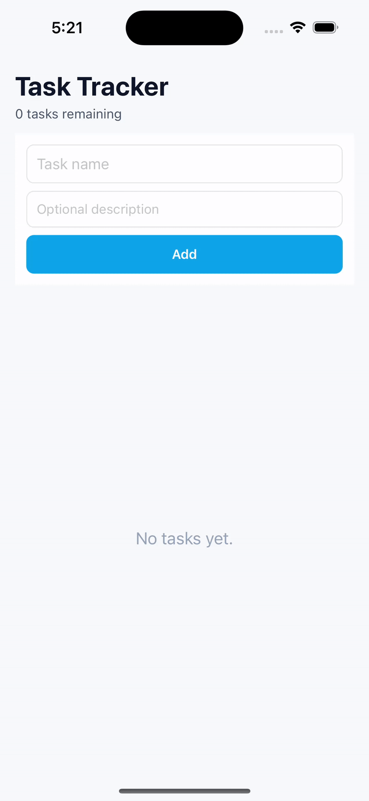

Task Tracker — React Native (TypeScript)
========================================

A modern **Task Tracker App** built with **React Native**, **TypeScript**, and **Redux Toolkit**, showcasing clean architecture, data persistence, and offline-first capabilities.

This project demonstrates best practices in **state management**, **local storage**, and **modular architecture** for building scalable React Native applications.



Main Features
-------------

1.  State management using Redux Toolkit for predictable, scalable data flow
2.  Persistent local storage with Redux Persist and AsyncStorage
3.  Offline-first logic with simulated network synchronization
4.  Modular architecture with reusable UI components and hooks
5.  TypeScript-based development for strong type safety
6.  Smooth user experience with React Native LayoutAnimation
7.  Jest unit testing for Redux and persistence logic
8.  Ready-to-extend structure for real-world scalability
    

Folder Structure
----------------
```
task-tracker/  
├── src/  
│   ├── components/  
│   │   ├── TaskInput.tsx         # Task creation input field  
│   │   ├── TaskItem.tsx          # Reusable task item component  
│   ├── store/  
│   │   ├── index.ts              # Redux store with persistence setup  
│   │   └── taskSlice.ts          # Redux slice for tasks  
│   ├── hooks/  
│   │   └── useTask.ts            # Simulated task Screen logic  
│   ├── screens/  
│   │   └── TaskScreen            # UI for Screens  
│   ├── utils/  
│   │   └── serverUtils.ts        # helper functions for online sync  
│   ├── types/  
│   │   └── index.ts              # Shared TypeScript types  
│   ├── App.tsx                   # Main entry component  
│   └── ...  
├── __tests__/store.test.ts       # Unit tests for Redux store  
├── package.json  
└── README.md   `
```

### Key Modules

*   **components/** — Reusable and composable UI components
*   **store/** — Redux Toolkit slices, reducers, and persistence setup
*   **hooks/** — Custom logic for Tasks, redux, etc.    
*   **types/** — Centralized type definitions
    

Tech Stack
----------

### Core

*   React Native — Cross-platform mobile app development
*   TypeScript — Static typing for JavaScript
    

### State Management

*   Redux Toolkit — Modern Redux with simplified configuration
*   Redux Persist — Persistent Redux state across sessions  
*   AsyncStorage — Local device storage
    

### UI and Animation

*   React Native — Core components and APIs
*   LayoutAnimation — Smooth animations for layout updates
    

### Testing

*   Jest — Testing framework for JavaScript and TypeScript
    

Getting Started
---------------

### 1\. Clone the repository

```   
git clone https://github.com/umerf21/taskTracker  
cd task-tracker   `
```
### 2\. Install dependencies
```
yarn install
```

### 3\. Start Metro Bundler

```   
yarn start   
```

### 4\. Run the app

For iOS:

```   
yarn ios   
```

For Android:

```   
yarn android   
```

Redux Persist Configuration
---------------------------

Tasks are stored locally and automatically rehydrated on app restart.

**Example Store Configuration:**
```   
import { configureStore } from '@reduxjs/toolkit';  
import { persistReducer, persistStore } from 'redux-persist';  
import AsyncStorage from '@react-native-async-storage/async-storage';  
import taskReducer from './taskSlice';  

const persistConfig = {    
        key: 'root',    
        storage: AsyncStorage,  
    };  

const persistedReducer = persistReducer(persistConfig, taskReducer);  
export const store = configureStore({    reducer: persistedReducer,  });  
export const persistor = persistStore(store);   
```

State Flow
----------

1.  User adds, edits, or deletes a task.
2.  Redux Toolkit dispatches actions (addTask, updateTask, removeTask).
3.  Redux Persist automatically stores the updated state in AsyncStorage.
4.  On app restart, the state is rehydrated from local storage.
5.  The app optionally performs a simulated sync when network is available.
    

Example Task Object
-------------------

```
export type Task = {    
    id: string;    
    title: string;    
    completed: boolean;    
    createdAt: number;  
};   
```

Running Tests
-------------

Run Jest tests for Redux store and persistence logic:

```   
yarn test   
```

Future Improvements
-------------------

*   Add swipe-to-delete using React Native Gesture Handler
*   Implement push notifications for task reminders
*   Add filtering and categorization of tasks
*   Integrate with cloud backend (e.g., Firebase or Supabase)
*   Add dark mode and custom themes
*   Expand test coverage for reducers and UI components
    

Best Practices
----------------------------

This project demonstrates:

*   Scalable use of Redux Toolkit with Redux Persist in React Native
*   Structuring mobile projects for maintainability and readability
*   Offline-first data management principles
*   Type-safe development using TypeScript
*   Clean separation between UI, logic, and storage layers